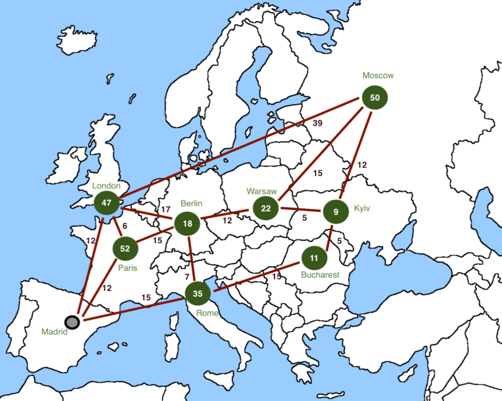

## The Pan-European Travel Challenge is about to begin.

Over the course of a week, an airline company organizes competition in all the main European capitals – each one with tempting prizes to be won.

You love to travel but you can’t possibly get to all these places. How do you get the most out of your week? By planning your route for minimum expense and maximum wins.
 
## Game rules:
- Earn points for each city you visit.
- Every city has a reward score, representing the points earned for travelling there.
- Travelling between two connected cities takes up 1 day, and consumes a certain amount of petrol (this amount can be seen as a number along the connecting lines).
- You may travel to the same city several times but the reward can be collected only once.
- Your trip is a week long; the route length can’t exceed the maximum number of days (7).
- Your journey must start and end in Madrid.
- The optimal route is the one that has the highest score, which is calculated by: Total rewards – Total gas. For example, if you only have 5 days, on this super-simple roadmap of Europe the optimal route would be: 
Madrid – London – Paris – Berlin – Rome – Madrid : 152 – 55 = 97
- If two or more routes produce the same score, the optimal route will be the shortest route.

## Program
The program  use the Breadth-first search in a list where the map with the prizes and cost is reflected. After calculate all possibilities we choose the better one basin on rules explaining above.
